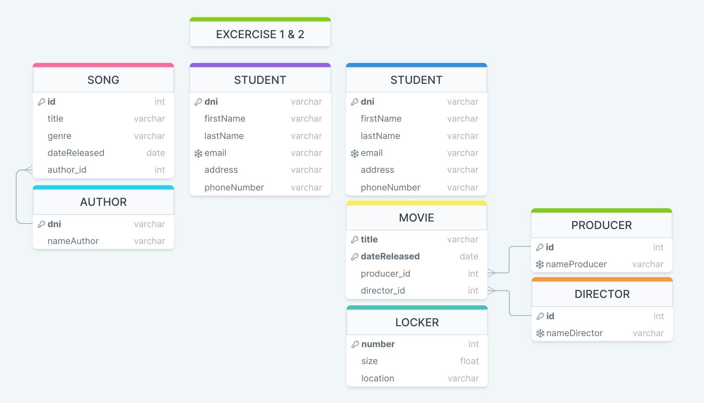

# Proyecto Identificadores Unicos

## Ejercicio 1: Identificar el identificador único y las claves primarias correspondientes

### Visión general

En esta práctica, identificará los identificadores únicos y las correspondientes claves primarias de los escenarios especificados.

### Tareas

1. ¿Cómo se busca una canción determinada en una recopilación completa? ¿Cuál sería un identificador único de SONG?

    **RTA: Por medio de un identificador único artificial.**

2. Piense en todos los alumnos de la clase. Cada alumno se describe mediante diferentes rasgos o atributos. ¿Qué atributo o atributos permiten seleccionar un único alumno respecto al resto de la clase?

    **RTA: Por medio del identificador único "DNI" del estudiante.**

3. Para cada entidad, seleccione el atributo que pueda ser el identificador único de cada entidad.

    **Entidad:** STUDENT 
    **Atributos:** student ID, first name, last name, address -> **student ID**

    **Entidad:** MOVIE 
    **Atributos:** title, date released, producer, director -> **Llave compuesta entre "title" y "date released"**

    **Entidad:** LOCKER 
    **Atributos:** size, location, number -> **number**

## Ejercicio 2: Identificar los identificadores únicos y agregarlos al ERD

### Visión general

En esta práctica, identificará los identificadores únicos y los agregará a un ERD.

### Tareas

1. Utilice el ERD de la base de datos académica de los ejercicios anteriores para identificar lo siguiente:

    a. Identificadores únicos 
    b. Identificadores únicos candidatos

    

---

Developed by <a href="https://github.com/jstorra">@jstorra</a>
