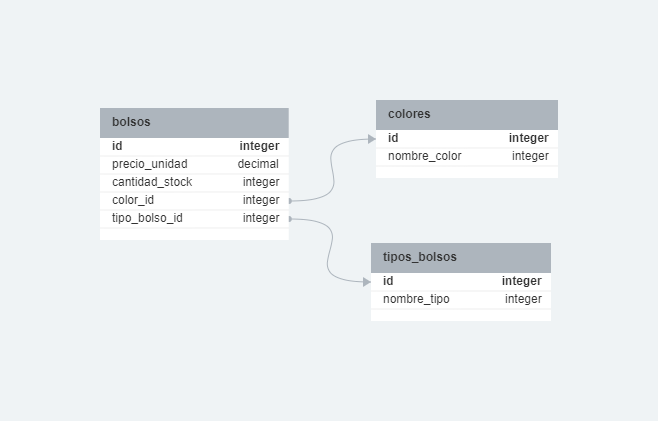
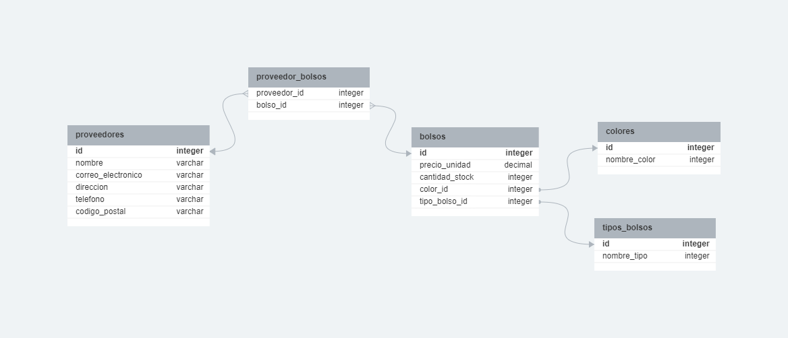
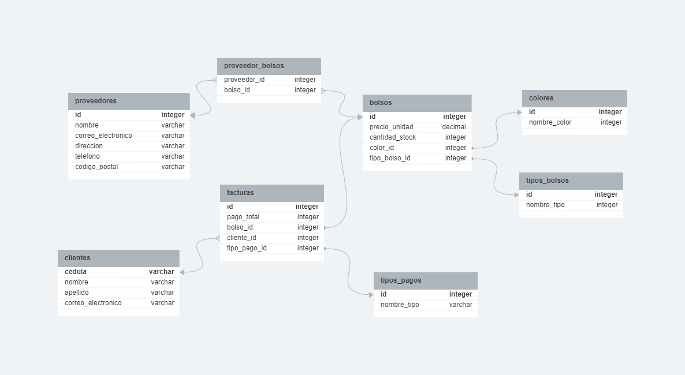
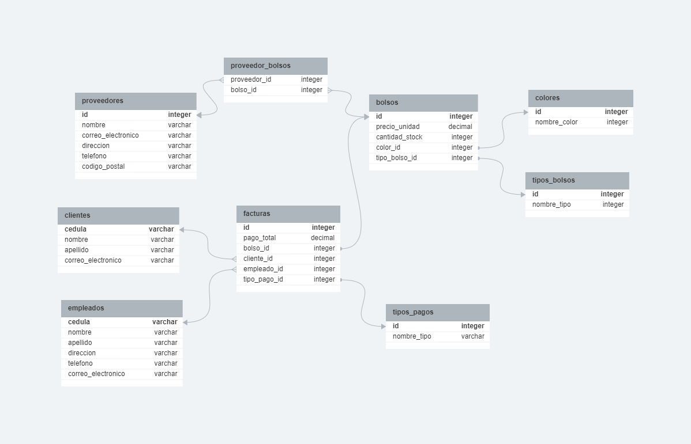
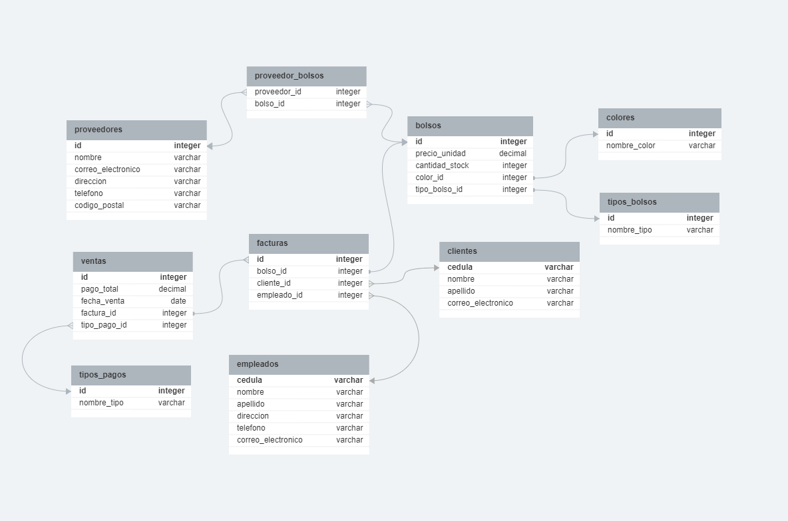
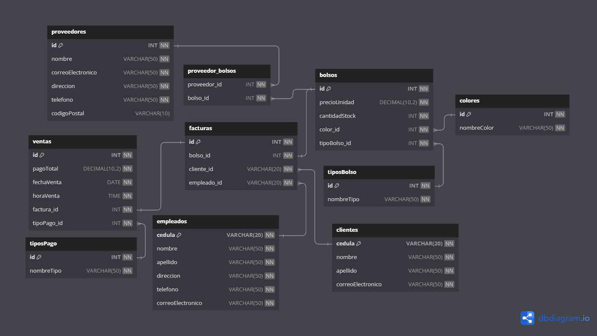

# Proyecto Modelo de datos Conceptuales

## Enunciado y Requerimientos

Un nuevo negocio de bolsos con nombre de marca _**Bags&Bags**_ requiere de un sistema para mejorar su flexibilidad en las ventas y modernizar sus gestiones. Tener en cuenta que la tienda considera estos 5 requerimientos necesarios:

-   **Gestión de bolsos:** Mantener el registro de los bolsos de la tienda y sus detalles como el color, el precio, la cantidad en stock, etc.

-   **Gestión de proveedores:** Mantener el registro de los proveedores de los bolsos que abastecen a la tienda con sus datos correspondientes.

-   **Gestión de clientes:** Mantener el registro de los clientes junto con su información personal necesaria para el sistema.

-   **Gestión de empleados:** Los empleados deben estar registrados en el sistema y se deberan almacenar sus datos personales con una mayor rigurosidad.

-   **Gestión de ventas:** El sistema debera registrar el historial de las ventas y cada venta debera tener su fecha de transacción, el pago total de la venta y el tipo de pago realizado.

## Modelos Físicos

    
<b>Gestión Bolsos</b>

    
    
<b>Gestión Proveedores</b>

    
    
<b>Gestión Clientes</b>

    
    
<b>Gestión Empleados</b>

    
    
<b>Gestión Ventas</b>

    

## Estructura Final

---

Developed by <a href="https://github.com/jstorra">@jstorra</a>
