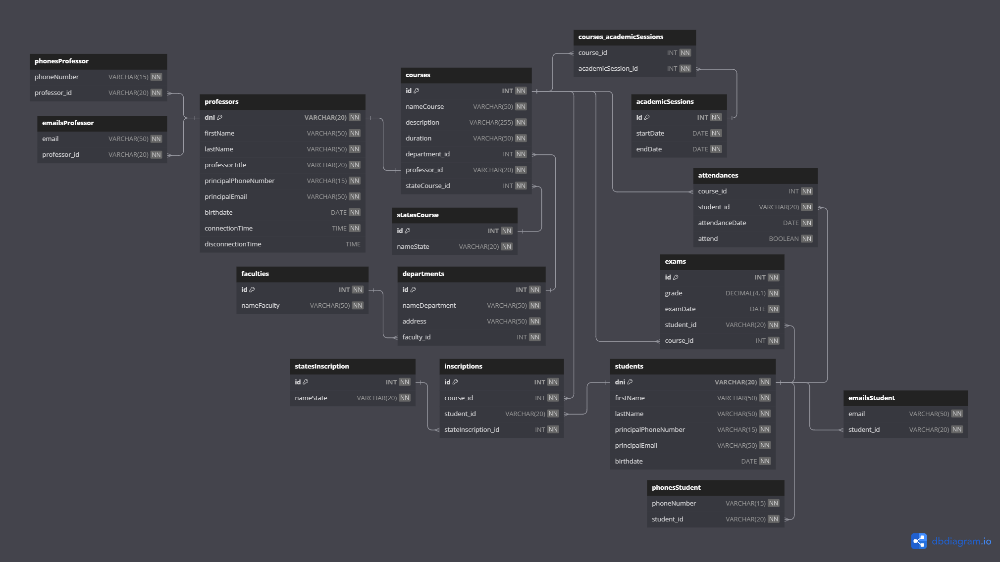

# University Project

-   ## Queries

    ### Entity professors

    Get professor where "dni" is 444555666D

    ```SQL
    SELECT * FROM professors WHERE dni = '444555666D';
    ```

    Get professors whose birthdate is after January 1, 1990

    ```SQL
    SELECT * FROM professors WHERE birthdate > '1990-01-01';
    ```

    ### Entity emailsProfessor

    Get record where the email is profesor@dominio.com

    ```SQL
    SELECT * FROM emailsProfessor WHERE email = 'profesor@dominio.com';
    ```

    Get quantity of emails of each professor

    ```SQL
    SELECT professor_id, COUNT(email) AS total_emails
    FROM emailsProfessor
    GROUP BY professor_id;
    ```

    ### Entity phonesProfessor

    Get record where "phoneNumber" is 111222333

    ```SQL
    SELECT * FROM phonesProfessor WHERE phoneNumber = '111222333';
    ```

    Get length of each phoneNumber

    ```SQL
    SELECT phoneNumber, LENGTH(phoneNumber) AS lengthNumber
    FROM phonesProfessor;
    ```

    ### Entity faculties

    Get records where "id" is odd

    ```SQL
    SELECT * FROM faculties WHERE id % 2 != 0;
    ```

    Get records where "nameFaculty" has a length greater than or equal to 20

    ```SQL
    SELECT * FROM faculties WHERE LENGTH(nameFaculty) >= 20;
    ```

    ### Entity departments

    Get records where "faculty_id" is greater than or equal to 1 and not equal to 2

    ```SQL
    SELECT nameDepartment FROM departments
    WHERE faculty_id >= 1 AND faculty_id != 2;
    ```

    Get records and describing if "address" has valid or invalid length

    ```SQL
    SELECT *, LENGTH(address)
    AS lengthAddress, IF(LENGTH(address) > 20, 'VALID', 'INVALID')
    AS validation
    FROM departments;
    ```

    ### Entity statesCourse

    Get name state where "id" is 3

    ```SQL
    SELECT nameState FROM statesCourse WHERE id = 3;
    ```

    Get quantity of courses with a specific state

    ```SQL
    SELECT nameState, COUNT(nameState) AS TotalCursos
    FROM statesCourse
    GROUP BY nameState;
    ```

    ### Entity courses

    Get course name where professor "id" is 111222333C

    ```SQL
    SELECT nameCourse FROM courses WHERE professor_id = '111222333C';
    ```

    Get course name and description of each course

    ```SQL
    SELECT nameCourse, description FROM courses;
    ```

    ### Entity students

    Get students whose birthdate is after the year 2000

    ```SQL
      SELECT * FROM students WHERE YEAR(birthdate) > 2000;
    ```

    Get students whose last name is Pérez

    ```SQL
    SELECT * FROM students WHERE lastName = 'Pérez';
    ```

    ### Entity emailsStudent

    Get student id where his "email" is estudiante@dominio.com

    ```SQL
    SELECT student_id FROM emailsStudent WHERE email = 'estudiante@dominio.com';
    ```

    Get email from the student with id 101010101K

    ```SQL
    SELECT email FROM emailsStudent WHERE student_id = '101010101K';
    ```

    ### Entity phonesStudent

    Get record where "phoneNumber" is 222222222

    ```SQL
    SELECT * FROM phonesStudent WHERE phoneNumber = '222222222';
    ```

    Get length of each phoneNumber

    ```SQL
    SELECT phoneNumber, LENGTH(phoneNumber) AS lengthNumber
    FROM phonesStudent;
    ```

    ### Entity academicSessions

    Get the duration of each academic session in days

    ```SQL
    SELECT startDate, endDate, CONCAT(DATEDIFF(endDate, startDate)," days")
    AS duration
    FROM academicSessions;
    ```

    Get the academic sessions which have more than 150 days

    ```SQL
    SELECT startDate, endDate, CONCAT(DATEDIFF(endDate, startDate)," days")
    AS duration
    FROM academicSessions
    WHERE DATEDIFF(endDate, startDate) > 150;
    ```

    ### Entity courses_academicSessions

    Get the course id where the academic session id is 4

    ```SQL
    SELECT course_id FROM courses_academicSessions WHERE academicSession_id = 4;
    ```

    Get records where course id is greater than 4

    ```SQL
    SELECT * FROM courses_academicSessions WHERE course_id > 4;
    ```

    ### Entity statesInscription

    Get state names that have even ids

    ```SQL
    SELECT nameState FROM statesInscription WHERE id % 2 = 0;
    ```

    Get records and mark them if have been finished or not

    ```SQL
    SELECT *, IF(nameState = 'Finalizada', 'YES', 'NO') AS finished
    FROM statesInscription;
    ```

    ### Entity inscriptions

    Get the next 2 records from the third record

    ```SQL
    SELECT * FROM inscriptions LIMIT 2 OFFSET 3;
    ```

    Get records sorted by "stateInscription_id" in ASC order

    ```SQL
    SELECT * FROM inscriptions ORDER BY stateInscription_id ASC;
    ```

    ### Entity exams

    Get records where grade was grather than or equal to 8

    ```SQL
    SELECT * FROM exams WHERE grade >= 8;
    ```

    Get records where the exam date is after December 11, 2023

    ```SQL
    SELECT * FROM exams WHERE examDate >= '2023-12-05';
    ```

    ### Entity attendances

    Get the attendances if the value of "attend" is true

    ```SQL
    SELECT * FROM attendances WHERE attend = 1;
    ```

    Get the attendances where the "course_id" is lower than 4 and "attend" is false

    ```SQL
    SELECT * FROM attendances WHERE course_id < 4 AND attend = 0;
    ```

-   ## Physical Model



---

<p align="center">Developed by <a href="https://github.com/jstorra">@jstorra</a></p>